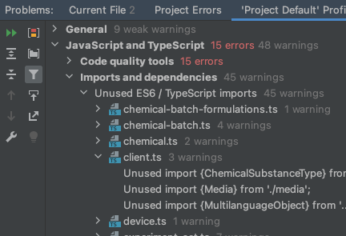

# Best practices for Angular development

In the following I have collected some best practices that I got used to during my work with Angular. As always with
best practices, some aspects are subjective. E.g. the naming of files does not matter for the compiled app. However, if
you are not working alone on a project, you should agree on a standard to ensure structured and uniform patterns. The
more common such best practices are in the community, the easier it will be for new developers to familiarize themselves
with a project.

## Angular style guide

In general, you should always follow the [Angular style guide](https://angular.io/guide/styleguide) which officially
collects some best practices for Angular.

## Turn on linting

Angular officially used the tslint package to analyze code smells. You IDE should be capable of integrating this, e.g.
Webstorm has a "Problems" tab, that is based on the linter configuration.



## Don't write inline styles

This is a very basic SOC rule that I regularly see people disregard. The following example is bad practice:

```html

<my-element style="width: 20rem; height: 20rem"></my-element>
```

Instead of inline styles, you should use a class name and make the style reusable:

```html

<my-element class="square-size"></my-element>
```

```css
.square-size {
    width: 20rem;
    height: 20rem;
}
```

## Write slim reusable components

Most often then not you will find yourself in refactoring components to make them reusable after you noticed, that you
need the same thing again, only slightly modified. So it's always a good idea to write components reusable in the first
place. In general, they should not include too much functionality, so they are more broadly applicable.

## Be aware of the cost of change detection

[Angular change detection](https://blog.angular-university.io/how-does-angular-2-change-detection-really-work/) can be
tricky. The biggest mistake you can make is to use to many ot too expensive function calls in templates. Angular will
call those for every change detection cycle. Depending on the code, those CD cycles can be quite numerous.

With this in mind, it's a good idea to use variables or pipes to get around this issue. If you want to get fancy, you
can use an allrounder pipe I wrote, here's the code:

```ts
/**
 * Pipe that let's you pipe just anything! Function calls in your templates are normally a bad idea, performance wise.
 * However you can get around this problem by writing pipes that don't trigger on every CD cycle but only when the arguments change.
 * Doing this for every function you want can be painful however! Here comes arbitraryPipedFunction for the rescue!
 * Just pass the function, the arguments, the context and some extra arguments you may want to include in the watches arguments for the
 * pipes internal CD. There you go. One pipe to rule them all.
 */
@Pipe({
    name: 'arbitraryPipedFunction'
})
export class ArbitraryPipedFunctionPipe implements PipeTransform {

    /**
     * Pipes anything!
     * Call it in your template like so:
     * \`\`\`html
     * <div>{{myFunction | arbitraryPipedFunction : this : [42,'sinus'] : watchMe, watchMeToo}}</div>
     * \`\`\`
     * @param functionToPipe function that should get piped.
     * @param context This context of the called function.
     * @param args Arguments to pass to functionToPipe.
     * @param changeDetectionArgs Arbitrary number of extra arguments to watch for changes (changes to them will trigger the pipe)
     * computation.
     */
    transform(functionToPipe: (...args) => any, context, args: any[] = [], ...changeDetectionArgs: any[]): any {
        return functionToPipe.bind(context)(...args);
    }

}
```

## Stay updated

Regularly check the newest Angular version and migrate as soon as possible. Also check the dependencies, npm can help
with that: ``npm outdated``. Also commands like `npm install` will tell you abound found vulnerabilities in dependencies
of your project.

## Communication between components

Probably your components need to communicate between each other. One straight forward solution is to use Angular's 
``@Input/@Output`` syntax. This is great if the communication only happens between two components that are tightly 
coupled. But if you need to communicate between "longer distances" this is not a good idea, because it would mean to
pollute components with unnecessary inputs and outputs just to propagate the information. 

A better way to achieve this is to use services that offer some observables which the information consuming components
can subscribe to, and the information producing components can emit on. 

Another way is to use NGRX actions and effects.

