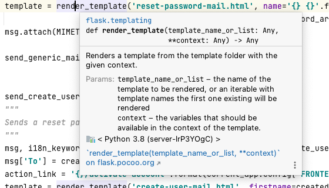

# Best practices for writing good code

## Use Meaningful Names for Variables and Functions

Consider an example, where you have two variables `is_vaccine_available` and `iva`. In a large program, it won't be easy
to guess what purpose `iva` serves without looking through some relevant lines of code. On the other hand, you can guess
that the variable `is_vaccine_available` is almost certainly being used to store the status of vaccine availability.

## Commenting & Documentation

Every function and class should be documented. This helps to understand the purpose of the function and their
parameters, especially for developers who are seeing the code for the first time. Also, IDEs nowadays can utilize
documentation strings to provide previews etc. while you are coding:



But: Avoid obvious comments. If you follow the rule to give meaningful names to functions and variables, some comments
like the following can be just unnecessary:

```python
# Get the country code
country_code = get_country_code(config)
 
# If country code is US
if country_code == 'US' 
    # Display the form input for state
    echo form_input_state()
```

This could be combined in a single line:

```python
# Display state selection for US users
country_code = get_country_code(config)
 
# if country code is US
if country_code == 'US' 
    # display the form input for state
    echo form_input_state()
```

## Indentation / formatting

Indentation should be consistent. The easiest way to achieve this is to use your IDE auto formatting functionality. In
your project, decide on a coding style, set it up in your IDE, lookup the hotkey for auto formatting a file and there
you go. You can also tell your IDE to apply auto formatting before each commit.

It is important, that when using auto formatting every team member uses the same auto formatting rules. Otherwise it can
happen that the formatting switches back and forth between every commit, and you won't be able to see actual code
changes in the diff.

## Code grouping

More often than not, certain tasks require a few lines of code. It is a good idea to keep these tasks within separate
blocks of code, with some spaces between them. Adding a comment at the beginning of each block of code also emphasizes
the visual separation.

Here is a simplified example:

```python
# get list of forums
forums = array()
r = mysql_query("SELECT id, name, description FROM forums")
while (d = mysql_fetch_assoc(r)):
    forums []= $d
}
 
# load the templates
load_template('header')
load_template('forum_list',$forums)
load_template('footer')
```

## DRY principle

DRY stands for Don't Repeat Yourself. Also known as DIE: Duplication is Evil.

The principle states:

> "Every piece of knowledge must have a single, unambiguous, authoritative representation within a system." — Wikipedia

The purpose for most applications (or computers in general) is to automate repetitive tasks. This principle should be
maintained in all code, even web applications. The same piece of code should not be repeated over and over again.

For example, most web applications consist of many pages. It's highly likely that these pages will contain common
elements. Headers and footers are usually the best candidates for this. It's not a good idea to keep copying and pasting
these headers and footers into every page. Instead, put that header and footer code in separate source files to be
included wherever they are needed.

## Avoid deep nesting

Too many levels of nesting can make code harder to read and follow.

```python
def do_stuff():
 
    if is_writable(folder)):
        if fp == fopen(file_path,'w'):
            if stuff == get_some_stuff():
                if fwrite(fp, stuff):
                  pass
                else:
                    return false
            else:
                return false
        else:
            return false
    else:
        return false
```

For the sake of readability, it is usually possible to make changes to your code to reduce the level of nesting:

```python
def do_stuff():
  
    if !is_writable(folder)):
        return false
 
    if !fp == fopen($file_path,'w'):
        return false
 
    if !$stuff == get_some_stuff():
        return false
 
    if fwrite(fp, $stuff):
        pass
    else:
        return false
}
```

## Refactoring

When you "refactor," you make changes to the code without changing any of its functionality. You can think of it like
a "cleanup," for the sake of improving readability and quality.

This doesn't include bug fixes or the addition of any new functionality. You might refactor code that you have written
the day before, while it's still fresh in your head, so that it is more readable and reusable when you may potentially
look at it two months from now. As the motto says: "refactor early, refactor often."

You may apply any of the "best practices" of code readability during the refactoring process.

## Limit function size

A function should have a maximum number of lines. As a rule of thumb we can say that around 25 lines of code for a
single function should be sufficient. There are exceptions, of cause, but normally if it get's longer, you can probably
take some part of the function and write another reusable function from it.
